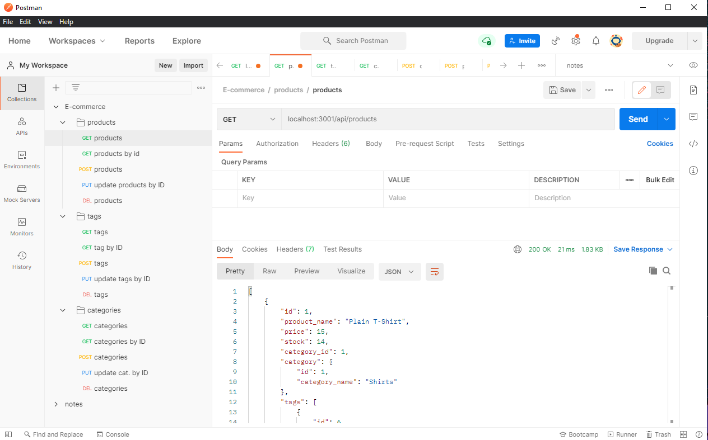

# E-Commerce Back End

## Description 

This E-Commerce back-end app allows a user to build their database and inventory. Users can add in categories, products, and tags. Users can associate each product to a category and give each product description tags. This app uses nodejs. Run it in your code editor of choice with node. Postman can be used to test the routes.

## Contents
* [Installation](#Installation)
* [Screenshots](#Screenshots)
* [Usage](#Usage)
* [Questions](#Questions)
* [Credits](#Credits)

## Installation

* Clone to repo to your local device.
* Have node installed
* Run 'npm init'
* Run 'npm install'
* Create the DB in mySQL.
* Run 'node seeds/index.js' 
* Run 'node server.js' to start the server.
Be sure to enter your mysql username and password in the .env file.

## Screenshots

## Usage 

This app used Postman to test. In Postman the user can add, change, or delete a category, tag, or product in the database. In order to do this, the user needs to GET /api/products. Use  /api/products/:id for one item. Replace products with tags or categories to GET the other endpoints. Create a new POST request with /api/products and enter the new product/caregories/tags in the Key below. To update and item use PUT /api/products. Adjust valueas as desired. to delete use DELETE /api/products.

## Questions

Have a question? Contact me on github @heparish 

## Credits

* My amazing tutor Sara, who saves my butt every session. 
* Project created by Haley Parish and her feline desk mate, Charlie.
